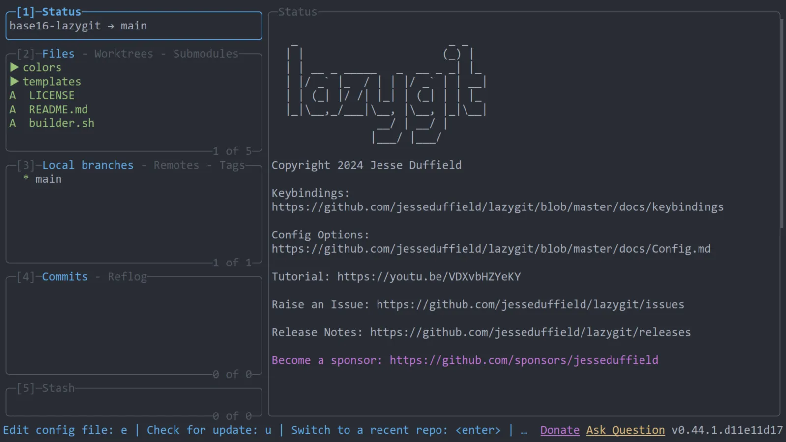
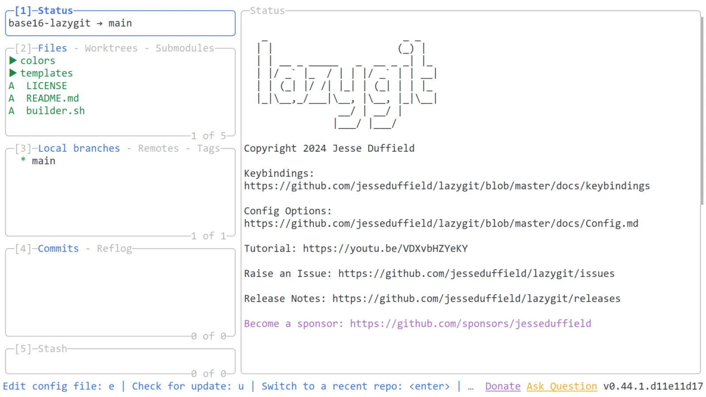

# tinted-lazygit

<!-- markdownlint-disable MD013 -->

This repo provides templates for using [Base16](https://github.com/tinted-theming/home) color schemes with [lazygit](https://github.com/jesseduffield/lazygit), a simple terminal UI for git commands.

All files in `themes` directory generated by [tinted-builder-rust](https://github.com/tinted-theming/tinted-builder-rust?tab=readme-ov-file).

## Examples

### base16-onedark



### base16-google-light



## Usage

### Manual

You can find an example config in `examples/config.yml`.

Place this file in:

- Linux: `~/.config/lazygit/config.yml`.
- MacOS: `~/Library/Application\ Support/lazygit/config.yml`.
- Windows: `%LOCALAPPDATA%\lazygit\config.yml` (default location, but it will also be found in `%APPDATA%\lazygit\config.yml`.

### Tinty

1. Add the following to `~/.config/tinted-theming/tinty/config.toml`:

```toml
[[items]]
name = "tinted-lazygit"
path = "https://github.com/tinted-theming/tinted-lazygit"
themes-dir = "themes"
supported-systems = ["base16"]
```

2. Use a flag `--use-config-file` to combine multiple configuration files. In this case, it's the color scheme file that `tinty` generates automatically in `~/.local/share/tinted-theming/tinty/base16-nwg-dock-colors-file.css` and the main configuration `config.yml` file.

```bash
lazygit --use-config-file="$XDG_CONFIG_HOME/lazygit/config.yml,$XDG_DATA_HOME/tinted-theming/tinty/tinted-lazygit-themes-file.yml"
```

Or an environment variable `LG_CONFIG_FILE`.

```bash
LG_CONFIG_FILE="$XDG_CONFIG_HOME/lazygit/config.yml,$XDG_DATA_HOME/tinted-theming/tinty/tinted-lazygit-themes-file.yml" lazygit
```

3. `tinty apply base16-google-light` to change the theme to `base16-google-light`.

## License

MIT
