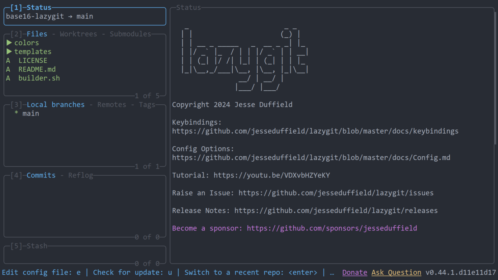

# base16-lazygit

<!-- markdownlint-disable MD013 -->

This repo provides templates for using [Base16](https://github.com/tinted-theming/home) color schemes with [lazygit](https://github.com/jesseduffield/lazygit), a simple terminal UI for git commands.

All files in `colors` directory generated by [lustache](https://luarocks.org/modules/olivine-labs/lustache), [lustache-cli](https://github.com/djmattyg007/lustache-cli) and [builder](https://git.sr.ht/~blueingreen/base16-builder).

## Examples

### base16-onedark

### base16-google-light

## Usage

You can find an example config in `examples/config.yml`.

Place this file in:

- Linux: `~/.config/lazygit/config.yml`.
- MacOS: `~/Library/Application\ Support/lazygit/config.yml`.
- Windows: `%LOCALAPPDATA%\lazygit\config.yml` (default location, but it will also be found in `%APPDATA%\lazygit\config.yml`.

## License

MIT
